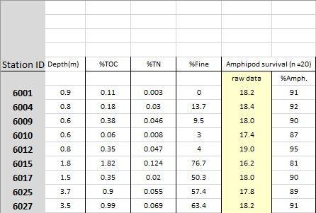
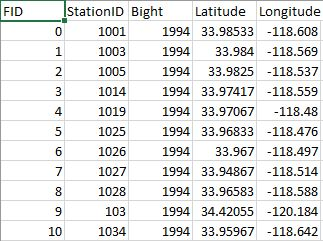

```{r setup, echo=FALSE, warning=FALSE, purl=FALSE, message=FALSE}
options(repos = "http://cran.rstudio.com/")
pkgs <- c("dplyr", "knitr")
x<-lapply(pkgs, library, character.only = TRUE)
opts_chunk$set(tidy = FALSE, message = F, warning = F)
```

# R luncheon 2

## Lesson Outline

* [Problem scope]
* [Housekeeping]
* [Data import]
* [Data wrangle]
* [Data analysis]
* [Summary]

Welcome to the second R luncheon!  The format for this session will be similar to the first, with the general goal of better understanding how we can use R to approach real-world examples in bite size chunks. The discussion will contain four parts:

1. Presentation of the problem: what we are starting with and where we want to go

1. Steps to address the problem in general terms

1. Specific steps to address the problem using R

1. Execution of the workflow to achieve the final product  

Please note that this is not an introduction to R. You can visit any of the other topics on our [main page](index.html) for a refresher on some of the basics. In the mean time, feel free to ask plenty of questions as we go through today's lesson!

# Problem scope

Today's session will focus on a sediment chemistry dataset for several monitoring sites along the coast.  The raw data are provided in two separate Excel spreadsheets, one containing the [sediment data](https://sccwrp.github.io/SCCWRP_R_training/data/Sed_chem_tox - expanded.xlsx) and the other containing station [location data](https://sccwrp.github.io/SCCWRP_R_training/data/AllBightStationLocations.csv).  Each site in the dataset has estimates of the concentration of different contaminants (e.g., mercury, lead, etc.) that were found in the sediment samples.  Toxicity tests were also conducted for each sample that evaluated the mortality/survivorship of organisms that were exposed to the sediment.  




Our goal for this dataset is to explore relationships among the stations to identify:

1. Spatial patterns among the measurements, and 

2. Characterize any association of these measurements with mortality/survivorship.  

This type of information can help identify which pollutants are of most concern and where efforts should be focused to minimize exposure risk.  Alternatively, monitoring is expensive and it can help identify which measurements may not need to be sampled as frequently.  


This dataset is a perfect example of a real-world analysis challenge.  The data are provided with minimal background and the goal of the analysis is very general.  We don't know where the stations are located, nor do we have any prior knowledge about expected patterns.  As a result, the analysis will be exploratory and a relatively flexible approach will be used to answer the research question.  Our steps will include:

1. Import the station chemistry data and station location data

1. Wrangle the data to a consistent format.  This will include formatting the chemistry data to deal with any Excel artifacts and joining the final dataset with the location data for plotting.  We'll also have to think about dealing with outliers or other "incorrect" data.  This is a guarantee with such a large dataset.

1. Evaluate any spatial relationships among the variables.  Do any measurements relate to depth? What about latitude or longitude?  

1. Evaluate assocations of the chemistry data with results from the toxicity tests.  Are any variables standing out?  What are any other challenges we need to consider?  


# Housekeeping

Let's start by opening RStudio, creating a new project, and downloading the data to the project.  

## Open RStudio

Find the RStudio shortcut and fire it up.  You should see something like this: 


## Create a new project in RStudio

To create a new project, click on the File menu at the top and select 'New project...'


## Download the data to your project

You can download the two data files from this [link](https://sccwrp.github.io/SCCWRP_R_training/data/Sed_chem_tox - expanded.xlsx) for the chemistry data and this [link](https://sccwrp.github.io/SCCWRP_R_training/data/AllBightStationLocations.csv) for the station locations.  Once downloaded, you'll have to copy and paste the Excel file to your project.  Run `getwd()` in the R console if you're not sure where this is. 

You can also download the data file directly in R. This will download the data and save the file to your new RStudio project in a single step.

```{r, eval = F}
# download the first file
download.file(
  url = 'https://sccwrp.github.io/SCCWRP_R_training/data/Sed_chem_tox - expanded.xlsx',
  destfile = 'Sed_chem_tox - expanded.xlsx'
  )

# download the second file
download.file(
  url = 'https://sccwrp.github.io/SCCWRP_R_training/data/AllBightStationLocations.csv',
  destfile = 'AllBightStationLocations.csv'
  )
```

# Data import

Now that we've got our project setup with the data, let's open a new script and load some R packages that we'll be using. 

Open a new script from the File menu...


Once the script is open, save it using the drop down file menu on the top left.  Give it an informative name (e.g.,`Rluncheon2.R`) and save it in your project's home directory.  This should be the default location selected by RStudio when you save the file.

We'll be using functions from the [tidyverse](https://www.tidyverse.org/) collection of packages to import, wrangle, and plot the data.  Checkout our training material [here](https://sccwrp.github.io/SCCWRP_R_training/Data_Wrangling_1.html#the-tidyverse) if you need a brush up.  Run this line in the R console if you don't have the tidyverse installed.

```{r, eval = F}
install.packages('tidyverse')
```

In the script you just opened, add the following lines to load the tidyverse package and the readxl package (for data import).

```{r, message = F, warning = F}
library(tidyverse)
library(readxl)
```

Then add this line to import the chemistry dataset using the `read_excel()` function.  The imported dataset will be assigned to the `datchem` variable in the workspace for your current R session.  We'll import the station location data using the base R function `read.csv`.  As a side note, you want to always use the argument `stringsAsFactors = F` when importing data with `read.csv`.  This will ensure that any column that looks like character data will actually be imported as character data.  Otherwise, the data are imported as factors, which is not wrong but there may be undesired side effects later on (more info [here](http://www.win-vector.com/blog/2018/03/r-tip-use-stringsasfactors-false/)).

```{r, echo = F, message = F}
datchem <- read_excel('data/Sed_chem_tox - expanded.xlsx')
datlocs <- read.csv('data/AllBightStationLocations.csv', stringsAsFactors = F)
```
```{r, eval = F}
datchem <- read_excel('Sed_chem_tox - expanded.xlsx')
datlocs <- read.csv('AllBightStationLocations.csv', stringsAsFactors = F)
```

Let's get a feel for the dataset before we proceed.

```{r}
head(datchem)
str(datchem)
head(datlocs)
str(datlocs)
```

# Data wrangle

Neither of our two datasets are in a format that allows us to easily evalute relationships among the variables.  We'll tackle the chemistry data first.  We can't work with the data in its current format because of some artificts left over when we imported the Excel spreadsheet.  Here are a few of the issues we'll have to handle:

1. Incorrect first row

1. Some columns we don't care about

1. Some columns are character strings when they should be numeric

1. Some column names are inconvenient to work with, e.g., we don't want to type out names with lots of mixed characters

Here's how we can address these issues step by step. First, remove the first row and overwrite the existing object:

```{r}
datchem <- datchem[-1, ]
```

Remove two columns we don't need using the `select` function with the `-` sign.  The amphipod survival column is redundant with `%Amph.` and `X__2` is a bunch of comments we don't need. 

```{r}
datchem <- datchem %>% 
  select(-`Amphipod survival (n =20)`, -`X__2`)
```

An additional problem is that some columns were character strings but we know that every entry should be numeric.  R will try to guess the types of values in a column when the data are imported.  It will default to character data in ambiguous cases, i.e., a column contains a mix of numbers and letters.  To fix this issue, we can use the `mutate_if` function that conditionally converts columns given some criteria.  This is similar to the `mutate` function with an added twist by checking all columns at once.

```{r}
datchem <- datchem %>% 
  mutate_if(is.character, as.numeric)
```

This appeared to work, but why did we get so many warning messages?  This is R's way of telling us that it tried and failed to convert something to a number.  As a result, these entries were given an `NA` value.  If you look at the original dataset, you'll notice that some entries were given as `?`.  These can't be converted to numbers, so an `NA` value is fine in this case.

We're almost done wrangling the chemistry dataset.  Now we just need to rename some of the columns.  Let's rename anything that includes a "special character" or is otherwise inconvenient to work with.

```{r}
datchem <- datchem %>% 
  rename(
    station = `Station ID`, 
    depth = `Depth\r\n(m)`,
    amph_surv = X__1, 
    embr_surv = `%M.Emb.Surv.`
  ) 
```

Now we can start working with the location data, which will be much simpler to work with because it was already in a flat-file format.  Our goal is to wrangle the data so that we can easily join it to the chemistry dataset.  Our chemistry dataset is from Bight 2008 so we first want to filter the station location data for the same year.  

```{r}
datlocs <- datlocs %>% 
  filter(Bight %in% 2008) 
```

Then we want to rename the StationID column to match that in our chemistry dataset.  This will let us join the two datasets using a shared column name.  The station column also has to be numeric to match the chemistry data.

```{r}
datlocs <- datlocs %>% 
  rename(station = StationID) %>% 
  mutate(station = as.numeric(station))
```

Finally, let's remove the `FID` and `Bight` columns that we don't need. 

```{r}
datlocs <- datlocs %>% 
  select(-FID, -Bight)
```

Here's what our cleaned up chemistry and location datasets look like.
```{r}
head(datchem)
head(datlocs)
```

Now we can join the two to create a single dataset (see [here](https://sccwrp.github.io/SCCWRP_R_training/Data_Wrangling_2.html#combining-data) for a refresher on joins). First let's see if all the station IDs that are in our chemistry data are also in our location data. 

```{r}
setdiff(datchem$station, datlocs$station)
```

Okay, so there's one station in our chemistry data that wasn't in our location data.  That's okay and an acceptable loss.  We'll use the `inner_join()` function to combine the two datasets by the station id.  This will drop all stations that aren't shared between the two datasets.   

```{r}
dat <- inner_join(datlocs, datchem, by = 'station')
```

We can verify that one station was lost by looking at the dimensions of the chemistry data compared to the joined data.

```{r}
dim(datchem)
dim(dat)
head(dat)
```

The last and final step before we start addressing our research question is to identify and possibly remove outliers.  There are quite a few definitions of what makes something an outlier.  Generally speaking, these are values that are "far" from the central tendency of the rest of the data, where "far" could be defined many ways, e.g., 1.5 x the interquartile range, > 95th percentile, etc.  There's no strict rule that applies to every dataset and the chosen definition depends on the needs of your analysis, and more importantly, what is considerable unacceptable in the eyes of you, the analyst.  

For this analysis, we're going to be looking at simple correlations among the variables.  In this sense, any observations that can skew a perceived correlation could be considered an outlier and these would typically be values that are due to measurement error, human error, etc. A good first step would be to look at a pairs plot of the data.  This is a matrix of all paired scatter plots for every variable in the dataset. We can use this to not only evalute relative associations but also find which pairs of values deviate wildly from the rest.  

We'll create a pairs plot by evaluating everything except the station column.  We'll set the argument `gap = 0` to minimize gaps between the plot panels to help us better see the plots. The argument `cex = 0.5` will reduce the point size to minimize clutter. Pro tip: you might get an error <span style="color:red">Error in plot.new() : figure margins too large</span>.  This simply means that the figure margins in RStudio's plot window (bottom right panel) are too small to plot the data.  Use the `windows()` function from the command line to make a new graphics device that you can expand. 
```{r, fig.height = 8, fig.width = 8}
pairs(dat[, -1], gap = 0, cex = 0.5)
```

It looks like we have some problem values:

* amphipod survivability < 40
* chromium > 100
* mercury > 3

We'll want to remove these by hand since these will likely cause problems, i.e., skewing correlation coefficients, linear models, etc. This is most easily done by selecting the variables from the dataset, subsetting by the offending values, and assigning an `NA` value.  We can do this by indexing with base R or using dplyr syntax, your choice.

```{r, eval = T}
dat$amph_surv[dat$amph_surv < 40] <- NA
dat$Cr[dat$Cr > 100] <- NA
dat$Hg[dat$Hg > 3] <- NA
```

Using dplyr syntax, this can be accomplished with `ifelse` statements:

```{r, eval = F}
dat <- dat %>% 
  mutate(
    amph_surv = ifelse(amph_surv < 40, NA, amph_surv), 
    Cr = ifelse(Cr > 100, NA, Cr), 
    Hg = ifelse(Hg > 4, NA, Hg)
  )
```

When this is done, we can verify that the offending values were removed by looking again at the pairs plot. 

```{r, fig.height = 8, fig.width = 8}
pairs(dat[, -1], gap = 0, cex = 0.5)
```

This is a relatively subjective approach to removing outliers.  At the end of the day, the true test is whether including or removing outliers changes the conclusions of the analysis results.  If the results don't change, than don't remove the values. If they do change, consider what may have caused the erroneous values.  Some values may be obviously wrong (e.g., outside of the possible range of expected values) or others may require consulting the original data.  You can try the below analysis by retaining the outliers to see if the conclusions change but for now we'll proceed with them removed.

# Data analysis

Now we can start addressing our research questions. Our first question is whether or not any of thes variables following some kind of spatial pattern.  This would suggest something about location is affecting sediment toxicity, such as different origins or different management actions that influence source/sink dynamics.  We can get a visual representation of these patterns by looking at how they vary by latitude and longitude. 

We can use ggplot for a quick assessment.  
```{r}
ggplot(dat, aes(x = Longitude, y = Latitude)) +
  geom_point() + 
  coord_cartesian()
```

Now let's overlay some of the survivability estimates on the points (you can swap out any of the other toxicity measures using the `colour` aesthetic).
```{r}
ggplot(dat, aes(x = Longitude, y = Latitude, colour = amph_surv)) +
  geom_point() + 
  coord_cartesian()
```

It looks like there are some patterns within bays but definitely nothing consistent across latitude or longitude. In fact, you can verify the lack of association by looking at the pairs plot above.  

There may be specific contaminants that vary spatially within each bay that are driving the changes.  To get a handle on which contaminants may be driving the exposure results, we can use a more quantitative plot to link the variables.  The GGally package is of great help here. 

```{r, eval = F}
install.package('GGally')
library(GGally)
```
```{r echo = F, message = F, warning = F}
library(GGally)
```

We can use the `ggpairs` function to make a beefed up version of the pairs plot.  In addition to paired scatterplots, you can get a better idea of the distribution of each variable and actual estimates of correlations between pairs of variables. We'll not look at the station, latitude or, longitude columns for this example. 

```{r, fig.height = 8, fig.width = 8}
ggpairs(dat[, -c(1:3)])
```

Great, now we've got some numbers.  Some of the chemical variables are clearly correlated with each other, whereas the degree of association with survivability varies.  Some of these associations may not even be linear and there may be other variables that are not captured in this dataset that describe the trends.  

If we want to dig further, we can look at any of the individual pairs for more detailed analysis.  This example shows a simple correlation test and a linear model to evaluate additive effects.  
```{r}
cor.test(dat$amph_surv, dat$Hg)
mod <- lm(embr_surv ~ Pb + Fe, dat)
summary(mod)
```

# Summary

Clearly this simple analysis is not doing this dataset justice, but we've identified an analysis workflow that identifies significant associations for follow-up analysis.  A good starting place would be to look at individual bays to minimize variation between locations.  Alternatively, a formal multivariate analysis that simultaneously compares all the data could be insightful (for example, [here](https://fawda123.github.io/sed_chem_tox/sed_chem_tox.html)).  Either way, we've covered some of the basics for good data stewardship defined within the constraints of our question.  These methods have value for any data analysis workflow. 


