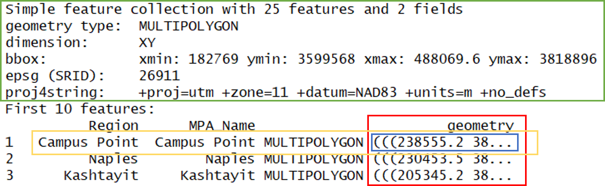

---
output:
  html_document:
    css: css/styles.css
---

```{r setup, echo=FALSE, warning=FALSE, purl=FALSE, message=FALSE}
options(repos = "http://cran.rstudio.com/")
pkgs <- c("dplyr", "knitr")
x<-lapply(pkgs, library, character.only = TRUE)
opts_chunk$set(tidy = FALSE, message = F, warning = F)
```

<script src="js/hideoutput.js"></script>

# R luncheon 3

## Lesson Outline

* [Vector data]
* [Simple features]
* [Creating spatial data with simple features]
* [Basic geospatial analysis]

Welcome to the third R luncheon!  By popular demand, the final two luncheons will explore using R as a GIS.  Today's session will focus on geospatial analysis using the new [simple features](https://r-spatial.github.io/sf/) package and our final session will focus on creating publication ready maps in R.  We will focus entirely on working with vector data in these next two lessons, but checkout the [raster](https://cran.r-project.org/web/packages/raster/) and [rgdal](https://cran.r-project.org/web/packages/rgdal/index.html) packages if you want to work with raster data in R.  There are several useful vignettes in the raster link.

Please note that this is not an introduction to R and you are also expected to have an understanding of basic geospatial concepts for these next two sessions. You can visit any of the other topics on our [main page](index.html) for a refresher on some of the R basics. In the mean time, feel free to ask plenty of questions as we go through today's lesson!

The goals for today are:

1) Understand the vector data structure

1) Understand how to import and structure vector data in R

1) Understand how R stores spatial data using the simple features package

1) Execute basic geospatial functions in R

## Vector data

Most of us should already be familiar with the basic types of spatial data and their components.  We're going to focus entirely on vector data for this lesson because these data are easily conceptualized as __features__ or discrete objects with spatial information.  We'll discuss some of the details about this later.  Raster data by contrast are stored in a regular grid where the cells of the grid are associated with values.  Raster data are more common for data with continuous coverage, such as climate or weather layers.  

Vector data come in three flavors.  The simplest is a __point__, which is a 0-dimensional feature that can be used to represent a specific location on the earth, such as a single tree or an entire city. Linear, 1-dimensional features can be represented with points (or vertices) that are connected by a path to form a __line__ and when many points are connected these form a __polyline__. Finally, when a polyline's path returns to its origin to represent an enclosed space, such as a forest, watershed boundary, or lake, this forms a __polygon__.


*Image [source](https://earthdatascience.org/courses/earth-analytics/spatial-data-r/intro-vector-data-r/)*

All vector data are represented similarly, whether they're points, lines or polygons.  Points are defined by a single coordinate location, whereas a line or polygon is several points with a grouping variable that distinguishes one object from another. In all cases, the aggregate dataset is composed of one or more features of the same type (points, lines, or polygons).

There are two other pieces of information that are included with vector data.  The __attributes__ that can be associated with each feature and the __coordinate reference system__ or __CRS__.  The attributes can be any supporting information about a feature, such as a text description or summary data about the features.  You can identify attributes as anything in a spatial dataset that is not explicitly used to define the location of the features.  

The CRS is used to establish a frame of reference for the locations in your spatial data.  The chosen CRS ensures that all features are correctly referenced relative to each other, especially between different datasets.  As a simple example, imagine comparing length measurements for two objects where one was measured in centimeters and another in inches.  If you didn't know the unit of measurement, you could not compare relative lengths.  The CRS is similar in that it establishes a common frame of reference, but for spatial data.  An added complication with spatial data is that location can be represented in both 2-dimensional or 3-dimensional space. This is beyond the scope of this lesson, but for any geospatial analysis you should be sure that:

1) the CRS is the same when comparing datasets, and 

1) the CRS is appropriate for the region you're looking at.    

 

*Image [source](https://nceas.github.io/oss-lessons/spatial-data-gis-law/1-mon-spatial-data-intro.html)*

To summarize, vector data include the following:

1) spatial data (e.g., latitude, longitude) as points, lines, or polygons

1) attributes

1) a coordinate reference system

These are all the pieces of information you need to recognize in your data when working with features in R.

## Simple features

R has a long history of packages for working with spatial data.  For many years, the [sp](https://cran.r-project.org/web/packages/sp/index.html) package was the standard and most widely used toolset for working with spatial data in R. This package laid the foundation for creating spatial data classes and methods in R, but unfortunately it's development predated a lot of the newer tools that are built around the [tidyverse](https://www.tidyverse.org/).  This makes it incredibly difficult to incorporate `sp` data objects with these newer data analysis workflows.  

The [simple features](https://r-spatial.github.io/sf/) or sf package was developed to streamline the use of spatial data in R and to align its functionality with those provided in the tidyverse.  The sf package is already beginning to replace sp as the fundamental spatial model in R for vector data.  A major advantage of sf, as you'll see, is its intuitive data structure that retains many familiar components of the `data.frame` (or more accurately, `tibble`).

Simple Features is a hierarchical data model that represents a wide range of geometry types - it includes all common vector geometry types (but does not include raster) and even allows geometry collections, which can have multiple geometry types in a single object. From the first sf package vignette we see:


You'll notice that these are the same features we described above, with the addition of "multi" features and geometry collections that include more than one type of feature.

## Creating spatial data with simple features

Let's get setup for today:

1) Open RStudio and create a new project.  

1) In the new project directory, create a folder called "data". 

1) Download  [this](https://sccwrp.github.io/SCCWRP_R_training/data/GIS_data.zip) zipped folder to your computer (anywhere) and copy its contents to the "data" folder in your project.  

1) From the file menu, open a new script within the project. At the top of the script, install the sf package if you haven't done so and load the package after installation.

```{r, eval = F}
install.package('sf')
library(sf)
```
```{r, message = F, echo = F, warning = F}
library(sf)
```

After the package is loaded, you can check out all of the methods that are available for `sf` data objects.  Many of these names will look familiar if you've done geospatial analysis before.  We'll use some of these a little bit later.

```{r}
methods(class = 'sf')
```

All of the functions and methods in sf are prefixed with st_, which stands for ‘spatial and temporal’.  This is kind of confusing but this is in reference to standard methods avialable in [PostGIS](https://en.wikipedia.org/wiki/PostGIS), an open-source backend that is used by many geospatial platforms.  An advantage of this prefixing is all commands are easy to find with command-line completion in sf, in addition to having naming continuity with existing software.

There are two ways to create a spatial data object in R, i.e., an `sf` object, using the sf package.

1) Directly import a shapefile

1) Convert an existing R object with latitude/longitude data that represent point features

We'll import a shapefile first and look at its structure so we can better understand the `sf` object. The `st_read()` function can be used for import.  Setting `quiet = T` will keep R from being chatty when it imports the data.

```{r}
polys <- st_read('data/Bight13_MPAs_Offshore.shp', quiet = T)
polys
```

What does this show us? Let's break it down.



* In green, metadata describing components of the `sf` object
* In yellow, a simple feature: a single record, or `data.frame` row, consisting of attributes and geometry
* In blue, a single simple feature geometry (an object of class `sfg`)
* In red, a simple feature list-column (an object of class `sfc`, which is a column in the data.frame)

We've just imported a multipolygon dataset with 25 features and 2 fields.  The dataset is projected using the UTM Zone 11 CRS.  You'll notice that the actual dataset looks very similar to a regular `data.frame`, with some interesting additions.  The header includes some metadata about the `sf` object and the `geometry` column includes the actual spatial information for each feature.  Conceptually, you can treat the `sf` object like you would a `data.frame`.   

Easy enough, but what if we have point data that's not a shapefile?  You can create an `sf` object from any existing `data.frame` so long as the data include coordinate information (e.g., columns for longitude and latitude) and you know the CRS (or can make an educated guess).  Let's first import a dataset from a .csv file.

```{r}
stations <- read.csv('data/AllBightStationLocations.csv', stringsAsFactors = F)
str(stations)
```

The `st_as_sf()` function can be used to make this `data.frame` into a `sf` object, but we have to tell it which column is the x-coordinates and which is the y-coordinates.  We also have to specify a CRS - this is just a text string or number (i.e, EPSG)  in a standard format for geospatial data. A big part of working with spatial data is keeping track of reference systems between different datasets.  Remember that meaningful comparisons between datasets are only possible if the CRS is shared.  

There are many, many types of reference systems and plenty of resources online that provide detailed explanations of the what and why behind the CRS (see [spatialreference.org](http://www.spatialreference.org/) or [this guide](https://www.nceas.ucsb.edu/~frazier/RSpatialGuides/OverviewCoordinateReferenceSystems.pdf) from NCEAS).  For now, just realize that we can use a simple text string in R to indicate which CRS we want.  Although this may not always be true, we can make an educated guess that the standard geographic projection with the WGS84 datum applies to our dataset.

```{r}
stations <- stations %>% 
  st_as_sf(coords = c('Longitude', 'Latitude'), crs = '+proj=longlat +ellps=WGS84 +datum=WGS84 +no_defs')
```

Now we can see the data in full `sf` glory.

```{r}
stations
```

These two datasets describe some relevant information about our Bight sampling program.  The `stations` data includes all locations that have been sampled from 1993 to 2013 and the `polys` data show locations of marine protected areas (MPAs) in the Bight.  We might be interested in knowing which stations occur in MPAs, how many stations, or when they were sampled.  We can address all of these questions in R, but before we proceed we need to make sure the two datasets share a CRS.  We can check this with `st_crs()`.

```{r}
st_crs(polys)
st_crs(stations)
```

You'll have to choose one of the reference systems to use as the common format.  Either one will work but sometimes it's better to go with the UTM format since it references location using actual units of measurement, i.e., meters.  This can make spatial analyses simpler, such as estimating areas or spatial overlap between datasets.  The `st_transform()` function can be used to transform an existing CRS for an `sf` obect to another.  

```{r}
stations <- stations %>% 
  st_transform(crs = st_crs(polys))
```

We can verify that both are now projected to UTM zone 11.
```{r}
st_crs(polys)
st_crs(stations)
```

## Basic geospatial analysis

As with any analysis, let's take a look at the data to see what we're dealing with before we start comparing the two.  

```{r}
plot(stations)
plot(polys)
```

So we have lots of stations and only a handful of MPAs.  You'll also notice that the default plotting method for `sf` objects is to create one plot per attribute feature.  This is intended behavior but sometimes is not that useful (it can also break R if you have many attributes).  Maybe we just want to see where the data are located independent of any of the attributes.  We can accomplish this by plotting only the geometry of the `sf` object.

```{r}
plot(stations$geometry)
plot(polys$geometry)
```

To emphasize the point that the `sf` package plays nice with the tidyverse, let's do a simple filter on the stations data using the dplyr package to get only the stations that were sampled 2013.

```{r}
filt_dat <- stations %>% 
  filter(Bight == 2013)
plot(filt_dat$geometry)
```

Now let's use the stations (all years) and MPA polygons to do a quick geospatial analysis.  Our simple question is:

__How many stations were sampled in each MPA and in which year?__

The first task is to subset the stations data (all years) by locations on the Bight that are MPAs.  There are a few ways we can do this.  The first is to make simple subset where we filter the station locations using a spatial overlay with the MPA polygons.  The second and more complete approach is to intersect the two data objects to subset and combine the attributes.

```{r}
stat_sub <- stations[polys, ]
plot(stat_sub$geometry)
stat_sub
```

With this first approach we can see which stations were located in an MPA, but we don't know the name of the MPA for each station. A better approach is to use `st_intersection` to both overlay and combine the attribute fields from the two data objects.

```{r}
stat_sub <- st_intersection(stations, polys)
plot(stat_sub$geometry)
stat_sub
```

Now we can easily see which Bight sampling stations and years were in which MPA polygon.  We can use some familiar tools from dplyr to get the aggregate counts of stations by years in each MPA using the `sf` object.

```{r}
stat_cnt <- stat_sub %>% 
  group_by(MPA_Name, Bight) %>% 
  summarise(
    cnt = n()
  ) 
stat_cnt
```

Notice that we've retained the `sf` data structure in the aggregated dataset but the structure is now slightly different, both in the attributes and the geometry column.  MPA polygons with more than one station within a year have been aggregated to multipoint objects and our `cnt` column shows the number of stations that make up the aggregation. This is a really powerful feature of `sf`: spatial attributes are retained during the wrangling process.  

We can also visualize this information with ggplot2. 

```{r, message = F}
library(ggplot2)
ggplot(stat_cnt, aes(x = MPA_Name, y = cnt)) + 
  geom_bar(stat = 'identity')
```

Let's make it more readable by facetting the plot by sample year and flipping the axes.

```{r}
ggplot(stat_cnt, aes(x = MPA_Name, y = cnt)) + 
  geom_bar(stat = 'identity') + 
  facet_wrap(~Bight) + 
  coord_flip()
```

We can see a clear increase in the number of MPAs that were sampled with more recent Bight sampling years.  Keep in mind that these data are still `sf` objects and we can leverage some of the mapping tools in R to spatially view these results.  Using the mapview package, we can easily create an interactive map of the MPA polygons and the intersected stations from `stat_sub`.  We'll cover this in more detail next time but here's a quick teaser.

```{r}
library(mapview)
mapview(polys) +
  mapview(stat_sub, zcol = 'Bight')
```

### Excercise

Let's repeat the above example but instead of spatially aggregating sample locations by MPA we'll aggregate by sediment characteristics. To accomplish this, we'll import the sediment chemistry dataset, join it with our sample locations, and aggregate the chemistry data by MPA.  We'll end up with an average concentration of some sediment data for each MPA.

1) Import the sediment chemistry data into R from the data folder using `read_excel()` from the readxl package.  This file is called `data/B13 Chem data.xlsx`.

1) From the chemistry data:

     * `select()` the `Year`, `StationID`, `Parameter`, and `Result` columns.
     
     * Use `filter()` to get only the rows in `Year` that are equal to 2013.  Then use `filter()` again to get rows for the `Parameter` column that are equal to `Arsenic` (hint: `filter(chemdat, Year == 2013 & Parameter == 'Arsenic'`)

     * Use `rename()` to rename the `Year` column to `Bight`.  This will let you join the chemistry data with our stations data.

1) Using our `stat_sub` dataset created above, use `inner_join()` to join `stat_sub` with the chemistry data.  Then use `select()` to select only the `StationID` and `Result` columns from the joined dataset.

1) Now use `st_join()` to spatially join the MPA polygon dataset to the joined chemistry/stations dataset (hint: `polyjn <- st_join(polys, chemjn)`).

1) Then use the joined polygon dataset for the aggregation of the sediment chemistry data.  Use `group_by(MPA_Name)` to establish a grouping variable, then summarise the `Result` column with `summarise()` to take the average arsenic values by each MPA (hint: `summarise(Result = mean(Result, na.rm = T))`).

1) Use mapview to plot the polygons and the argument `zcol = 'Result'` to show the average arsenic in each MPA.  

<div class="fold s o">
```{r results = 'hide'}
# import and wrangle sediment chemistry
library(readxl)
chemdat <- read_excel('data/B13 Chem data.xlsx') %>% 
  select(Year, StationID, Parameter, Result) %>% 
  filter(Year == 2013 & Parameter == 'Arsenic') %>% 
  rename(Bight = Year)

# join sediment chemistry with stat_sub from above
chemjn <- inner_join(stat_sub, chemdat, by = 'StationID') %>% 
  select(StationID, Result)

# spatially join the MPA polygon data to the joined chemistry/stations data
# aggregate the results by the average
polyjn <- st_join(polys, chemjn) %>% 
  group_by(MPA_Name) %>% 
  summarise(Result = mean(Result, na.rm = T)) 
  
# plot  
mapview(polyjn, zcol = 'Result')
```
</div>


